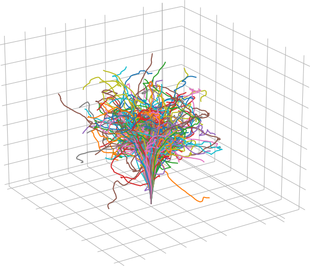

<h1 align="center">FOCUS</h1>

<p align="center"></p>

<div align="center">
<a href='LICENSE'>
    
</a>
<a href='https://focus.readthedocs.io/en/latest/?badge=latest'>
    
</a>
</div>

FOCUS stands for Full Orbit CUda Solver, it simulates the behavior of particles inside plasmas solving the motion equations.


## Compiling

You will need to install [meson](https://mesonbuild.com/Quick-guide.html) and [ninja](https://ninja-build.org/) in order to compile the project. In the root directory of the project run

```bash
$ meson build	# This will set the project build inside a directory named build
$ cd build	# feel free to change the name from build to whatever you prefer.

$ ninja		# This will be the one that actually builds the project.
```

## Contributing

For contributing guidelines see [CONTRIBUTING.md](CONTRIBUTING.md).
